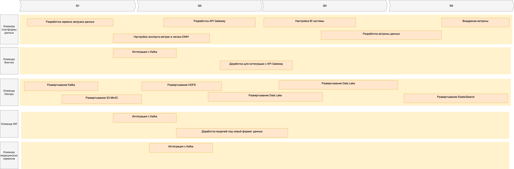

## Технологический радар

| Название технологии/методологи | Статус технологии | Комментарий                                         |
|--------------------------------|-------------------|-----------------------------------------------------|
| Microsoft SQL Server 2008	     | Hold              | Устаревшая технология                               |
| Power Builder                  | Hold              | Устаревшая технология                               |
| Apache Camel	                  | Hold              | Устаревшая технология                               |
| Python	                        | Adopt             | Устаявщееся технология как в проекте так и на рынке |
| Golang	                        | Trial             | Можно использовать ограничено                       |
| Java	                          | Adopt             | Устаявщееся технология как в проекте так и на рынке |
| Keycloak	                      | Adopt             | Устаявщееся технология на рынке                     |
| Apache Kafka	                  | Adopt             | Устаявщееся технология на рынке                     |
| PostgreSQL	                    | Adopt             | Устаявщееся технология на рынке                     |
| MinIO	                         | Adopt             | Устаявщееся технология на рынке                     |
| Бизнес логика в БД	            | Hold              | Устарвший подход                                    |
| Монолит	                       | Hold              | Устарвший подход                                    |
| Kong	                          | Trial             | Стоит попробовать для решения текущих проблем       |
| React.js	                      | Adopt             | Устаявщееся технология  на рынке                    |

## Roadmap

## Этапы

**Этап 1: Подготовка инфраструктуры**
- **Результаты**: Развернута вся необходимая инфраструктура для DataLake
- **Команды**: Devops, Команда платформы данных
- **Ресурсы**: 3 devops инженера, железо под инфраструктуру

**Этап 2: Разработка необходимых сервисов**
- **Результаты**: Разработаны все необходмые новые сервисы
- **Команды**: Команда платформы данных
- **Ресурсы**: 1 аналитик, 4 бекендера, 2 фронта, 2 тестировщика

**Этап 3: Переключение интеграторов**
- **Результаты**: Вся легаси инфраструктура и легаси интеграции переключены на новую схему
- **Команды**: Devops, Команда платформы данных, Финтех, Команда ИИ
- **Ресурсы**: 3 devops инженера, 4 бекендера, 2 тестировщика

**Этап 4: Внедрение**
- **Результаты**: Все компоненты запущены, корректно работает интеграция компонентов друг с другом
- **Команды**: Devops, Команда платформы данных
- **Ресурсы**: 3 devops инженера, 1 аналитик, 2 тестировщика

## Обоснование этапов

**Этап 1: Подготовка инфраструктуры**

Цель этапа подготовить всю необходимую инфраструктуру для запуска новой схемы работы с данными. Без инфраструктуры мы не сможем развернуть сервисы

**Этап 2: Разработка необходимых сервисов**

Нобходимо разработать базовые сервисы которые необходимы для работы Data Lake и ветрины данных и дальнейшего машстабирования системы анализа данных под требования бизнеса. 

**Этап 3: Переключение интеграторов**

На данном этапе мы строим "мосты" между старой системой и новой для бесперебойной работы организации

**Этап 4: Внедрение**

Проверка всего коплекса. Приемо-сдаточные испытания. Финальная проверка на бою
